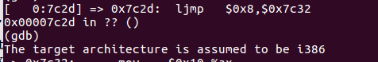
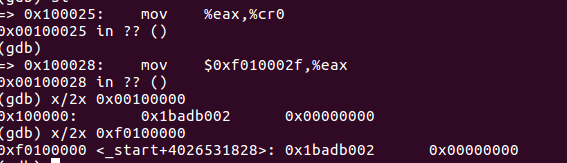
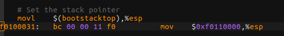
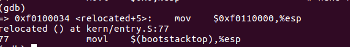

# Lab1:Booting a PC
&emsp;&emsp;第一部分基本上都是在讲汇编，暂且跳过，就从`The PC's Physical Address Space`这部分开始记录。  

## The PC's Physical Address Space
&emsp;&emsp;早期的PC只能寻址1MB内存，因此早期PC的物理地址在0x0处开始，在0x000FFFFF处结束。开始的640KB`Low Memory`是早期PC能使用的唯一的RAM。  
&emsp;&emsp;从0x000A0000到0x000FFFFF被硬件保留作特殊用途例如视频显示缓冲和非易失性存储器中的固件。这部分最重要的东西是BIOS，从0x000F0000待0x000FFFFF。  
&emsp;&emsp;由于设计限制JOS将只使用PC物理地址的开始256MB，所以我们将假装PC只有32位的物理地址空间。 

## The Rom Bios
1. 第一句指令是  

从这句指令中可以看出：  
    1. IBM PC在物理地址0x000ffff0处开始执行，在64KB区域为ROM BIOS保留的最顶端。  
    2. PC开始执行CS=0xf000和IP=0xfff0  
    3. 第一条指令是一条跳转指令，跳转到上述地址  
2. 这种设计确保BIOS总是能得到机器的控制权。在处理器重置中，处理器进入实模式并设置CS为0xf000,IP为0xfff0,这样执行在CS：IP段开始。而这个地址转换为物理地址就是0xffff0,就在BIOS的结束之前16字节，显然不够，所以要跳转回之前的地方。
3. Exercise 2:使用GDB的`si`指令跟踪BIOS的执行，可是有一个文档没法看...暂且跳过把  
4. 当BIOS运行时，设置一个中断描述符表并且初始化不同的设备例如VGA  
5. 在初始化PCI总线和所有BIOS知道的设备之后，它寻找引导设备从例如软盘、硬盘中  
## Part2 The Boot Loader
1. 如果硬盘是可以引导的，第1个扇区叫做引导扇区。当BIOS发现一个可引导的软盘或者硬盘，它读取512字节的引导扇区到物理地址为0x7c00到0x7dff的内存中，然后使用`jmp`跳转到该位置，将控制权交给boot loader。和BIOS一样，这些地址很随意--但是它们对PC来说是固定和表转的。  
2. 在实验的硬盘引导中，boot loader有512字节，由以下文件组成(boot/boot.S和boot/main.c)。boot loader必须包含两个功能：  
    1. 第1,boot loader将处理器从实模式切换到32位的保护模式。  
    2. 第2,boot loader通过x86的特殊I/O指令从IDE硬盘设备直接读取内核。  
3. 在理解了上述两个文件之后，看看文件(obj/boot/boot.asm)，这是boot loader的反汇编文件。上述两个文件和xv6的引导过程是类似的。  
4. Exercise 3：其实就是从boot loader的开始地址0x7c00处开始，慢慢了解boot loader都干了些什么事情，有一些问题，回答如下：  
    1. 应当是从这个位置开始  
      
    根据我的理解，真正导致从实模式切换到保护模式的原因应该是当把寄存器cr0的CR0_PE_ON位置1后，再进行的一次跳转，改变了CS寄存器，即进入了保护模式  
    2. boot loader的最后一条指令应该是`call *0x10018`，也就是开始执行内核代码。而kernal的第一条指令是  
    
    3. kernal的第一条指令位置是`0x10000c`  
    4. 根据我的理解，应该是从disk的第1个sector位置读取了kernel的ELF文件头之后，从文件头可以知道ELF的大小信息等，从而实现对整个kernel的读取
### Loading the Kernel
1. Exercise 4:练习对于指针的转换，这个稍微看了以下，没什么太大的问题，就不解释了。。。  
2. 当编译、链接1个C程序时，C文件转换为目标文件，包含以二进制格式编码的汇编指令，链接器最后把这些目标文件转换为一个二进制文件，也就是ELF格式的文件。  
3. 可以将ELF可执行文件看作是有加载文件头并跟着许多程序区域的东西，每一个都是1个连续的代码或者数据的块，将要被加载到特定地址的内存。  
4. 对于这个实验，我们感兴趣的区域有：  
    1. .text:程序的可执行指令
    2. .rodata:只读数据，例如ASCII字符常量（由C编译器生成）  
    3. .data:数据段，有程序的初始化数据，例如全局变量int x = 5;  
5. 特别注意.text段的VMA和LMA，VMA代表链接地址，LMA代表加载地址，加载地址是该段需要被加载到内存中的地址  
6. BIOS加载boot sector到从0x7c00开始的内存中，所以这是boot扇区的加载地址，这也是boot扇区开始执行的地址，所以这也是链接地址。通过给boot/Makefrag传递`-Ttext 0x7c00`可以设置链接地址，所以链接器会在生成的代码中生成正确的物理地址  
7. Exercise 5：在boot/Makefrag中修改链接地址，判断在哪一步会出错，经测试在

失效，具体原因为：暂时还不太清楚。。。  
8. 与boot loader不同，内核的链接地址和加载地址并不同，因为内核让boot loader在较低的地址加载它，而在较高的地址运行。  
9. 还有一个ELF中比较重要的信息：`e_entry`，维持着程序 *entry point*的链接地址：程序的`text`区的内存地址，也就是程序开始执行的地址  
10. Exercise 6:主要是指出当BIOS进入boot loader时和boot loader进入kernel时地址0x00100000的值分别是什么，为什么不同。当进入boot loader时显然为0,并没有什么意义，而进入kernel时则是进入kernel时指令的二进制代码，因为kernel是被加载到0x10000这个地址的，虽然entry是在0x10000c这个地址。
## Part3:The Kernel
1. 内核的链接比boot loader更为复杂，所以链接和加载地址不一致，在`kern/kernel.ld`的顶端  
2. 操作系统内核通常喜欢被链接和运行在很高的虚拟地址，为了使处理器的较低的虚拟地址空间给用户程序使用。  
3. 许多机器在0xf0100000没有虚拟地址，所以我们使用处理器的内存管理硬件将虚拟地址0xf0100000(内核代码期望运行的链接地址)映射到物理地址0x00100000(boot loader加载内核到的物理地址)。  
4. 现在，我们将映射物理内存的开始4M，足够启动并运行，我们使用手写的静态初始化的页目录和页表，它们在/kern/entrypgdir.c.直到kern/ertry.S设置`CR0_PG`，内存引用都被当作物理地址（严格来说是线性地址，但是boot/boot.S设置了线性地址到物理地址的直接映射），一旦`CR0_PG`被设置了，内存引用就成为了虚拟地址。`entry_pgdir`将虚拟地址0xf0000000到0xf0400000映射到物理地址0x00000000到0x00400000。一个不在此范围内的虚拟地址会引出硬件异常。  
5. Exercise 7:其实就是看在指令`mov %eax, %cr0`前后地址的变化，而这一指令就是是否开启虚拟地址映射机制，所以开启后0xf0100000和0x00100000地址处的内容一样，如下图

### Formatted Printing to the Console
P.S.这东西以前做过了。。。现在暂时懒得重新做一遍。。。以后有机会补上。。
1. 阅读`/kern/printf.c`,`lib/printfmt`和`kern/console.c`,回到一些问题。  
    1. 解释`printf.c`和`console.c`之间的关系，`console.c`提供了什么功能？这功能怎么被`printf.c`使用？  
    答:  
### The Stack
1. 最后一个练习将扩展C语言使用栈更细节，并且在进程中写一个有用的内核模拟函数，打印一个栈的`backtrace`：一系列保存IP的值。  
2. Exercise 9：决定内核在哪里初始化它栈，以及具体的它的栈在内存中哪个地方。内核是怎么为它的栈预留空间的？在这块预留区间的哪个尽头是栈指针初始指向的？  
这一问题我找到的线索是在kernel.asm中找到的，设置栈顶指针这么一句

而gdb中单步运行到这里时这样的
 
